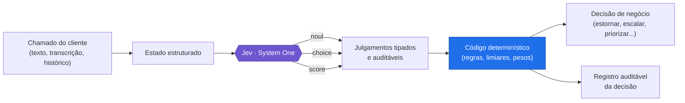

# Jev na Prática: Triagem Inteligente de Atendimento de Cartão de Crédito


> Como o **Jev** julga, com segurança, o que fazer com um chamado de suporte bancário — e por que a decisão final continua sendo do seu código.

Todo banco com operação de cartão de crédito enfrenta o mesmo gargalo: o cliente abre um chamado (o chip não é lido, a cobrança apareceu duplicada, o cliente contesta um lançamento) e alguém, ou algo, precisa decidir rapidamente o que fazer. Jogar o chamado inteiro para uma IA genérica e pedir de volta uma decisão de negócio pronta em texto livre é imprudente: isso coloca um modelo probabilístico para tomar uma decisão financeira com efeito regulatório, sem controle, sem auditoria e sem previsibilidade.

Este repositório demonstra a alternativa: o **Jev**, o modelo System One da [TypeSafe](https://typesafe.ai) usado aqui via SDK TypeScript (`@typesafe-ai/sdk`), não devolve uma decisão pronta — ele devolve respostas **tipadas** (`noul`, `choice`, `score`) para perguntas específicas e mensuráveis. A decisão final continua no código determinístico da aplicação.

**O Jev julga. O código decide.**

## Como funciona



Todos os exemplos rodam de verdade contra um cenário fictício: o SAC de cartão de crédito do **Banco Aurora**, com cartões Aurora Black e Aurora Classic. Nenhum resultado é simulado — os números variam levemente entre execuções, como em qualquer chamada real de LLM.

## Sumário

- [Configuração](#configuração)
- [Estrutura dos cenários](#estrutura-dos-cenários)
  1. [Estado](#1-estado)
  2. [Perguntas](#2-perguntas)
  3. [Respostas](#3-respostas)
- [Exemplos introdutórios](#exemplos-introdutórios)
- [Verificação de tipos](#verificação-de-tipos)
- [Docker](#docker)
- [Leia mais](#leia-mais)

## Configuração

Requisitos: Node.js 22+, acesso à TypeSafe e uma chave de API.

```sh
npm ci
cp .env.example .env
```

Adicione sua chave de API da TypeSafe ao `.env` (o arquivo é ignorado pelo Git).

## Estrutura dos cenários

Os cenários estão agrupados em três partes: preparar o estado, escrever as perguntas, e usar as respostas no código. Cada cenário tem sua própria pasta, e os arquivos dentro dela são numerados na ordem em que devem ser executados.

Rode qualquer arquivo com o script `scenario`:

```sh
npm run scenario 1-estado/01-chamado-cartao-com-defeito/001-texto-corrido.ts
```

Cada pasta leva o nome do caso de atendimento do Banco Aurora que ela usa para ensinar um conceito do Jev. O conceito em si está na coluna "O que aprendemos".

### 1. Estado

| Pasta | Caso do Banco Aurora | O que aprendemos |
|---|---|---|
| `01-chamado-cartao-com-defeito` | Cliente relata que o cartão não é lido na maquininha | O estado deve ser texto puro ou um objeto? |
| `02-ligacao-com-pedido-de-estorno` | Ligação: troca de endereço, cartão com defeito, estorno e cancelamento de cartão adicional | Como devemos estruturar o estado? |
| `03-cobertura-da-garantia-do-cartao` | Segunda via gratuita conforme os meses desde a emissão do cartão | Devemos preparar o estado antes de enviá-lo? |
| `04-frustracao-no-historico-de-chamados` | Histórico de chamados anteriores do cliente vs. só o chamado atual | Quanta informação devemos incluir no estado? |

### 2. Perguntas

| Pasta | Caso do Banco Aurora | O que aprendemos |
|---|---|---|
| `01-roteamento-por-time` | Encaminhar um chamado para cobranças, emissão, acesso ou funcionamento | Quando usar Noul ou Choice? |
| `02-intensidade-da-frustracao` | Medir o quanto o cliente está frustrado com um cartão que dá defeito | Quando usar Score em vez de Noul? |
| `03-sinais-de-escalonamento` | Pedido de supervisor, ameaça de cancelamento, menção a Procon/BACEN | Estamos pedindo ao Jev para julgar muitas coisas de uma vez? |
| `04-criterio-de-julgamento` | Estorno, roteamento por time e frustração, com e sem critério explícito | Deixamos claro o que cada resposta deve significar? |
| `05-triagem-completa-em-uma-chamada` | Sete julgamentos sobre o mesmo chamado urgente de cartão | Mais perguntas significam mais chamadas de API? |
| `06-email-para-envio-da-fatura` | Escolher, entre candidatos extraídos da mensagem, o e-mail para enviar a fatura | Como o Jev pode nos ajudar a extrair um valor, se ele não gera texto? |

### 3. Respostas

| Pasta | Caso do Banco Aurora | O que aprendemos |
|---|---|---|
| `01-roteamento-de-chamados-por-regra` | Rotear 5 chamados (defeito, emissão, cancelamento) para a ação certa | Quem deve tomar a decisão final, o Jev ou nosso código? |
| `02-confianca-para-agir-automaticamente` | Roteamento por time e probabilidade de estorno, com limiares de confiança | Nosso código deve confiar em toda resposta? |
| `03-quanto-de-confianca-para-estornar` | Estorno automático vs. sugerir resposta, segundo o risco da ação | Toda ação precisa do mesmo nível de confiança? |
| `04-fila-priorizada-de-chamados` | Priorizar uma fila de chamados combinando impacto, frustração e categoria do cartão | Como transformamos várias respostas em uma única decisão? |
| `05-estorno-com-jev-indisponivel` | O mesmo roteador de estorno, mas o Jev falha (timeout, 5xx) | O que o código faz quando o Jev não responde? |
| `06-evento-de-decisao-com-chave-idempotente` | Registrar uma decisão de estorno sob uma chave de idempotência | Como evito duplicar uma ação financeira num retry? |

> Os limiares e pesos usados nesses arquivos são exemplos didáticos. Escolha os seus testando mensagens do seu próprio atendimento.

## Exemplos introdutórios

Os dois arquivos na raiz são a introdução ao Jev.

```sh
npm run frustration-check
```

`frustration-check.ts` pergunta se uma mensagem de cliente expressa frustração.

```sh
npm run combined-judgment
```

`combined-judgment.ts` envia perguntas Noul, Choice e Score juntas, e usa um limiar de exemplo para decidir se a mensagem deve ser marcada para revisão.

## Verificação de tipos

```sh
npm run check
```

## Docker

```sh
docker build -t jev-demo-banking .
docker run --rm -v "$(pwd)/.env:/app/.env:ro" jev-demo-banking
```

Detalhes, variações de comando e a execução sem montar arquivo estão em [`_docs/setup.md`](_docs/setup.md).

## Leia mais

- 📖 Artigo completo, com a explicação de cada padrão: [`_docs/cenario.md`](_docs/cenario.md)
- ⚙️ Setup do zero, dependências e Docker: [`_docs/setup.md`](_docs/setup.md)
- 📚 Documentação oficial do SDK: [docs.typesafe.ai/sdk/javascript](https://docs.typesafe.ai/sdk/javascript)

---

Feito por **Alexsander Valente Telles**

[](https://www.alexsander.app)
[](https://www.linkedin.com/in/alexsander-valente/)
[](https://github.com/alevtelles)
